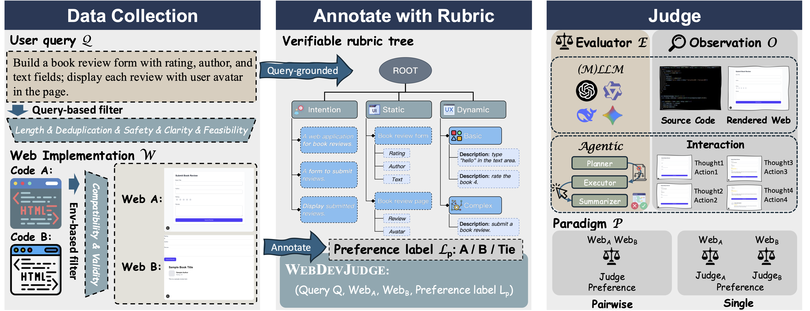

<div align="center">

# WebDevJudge: Evaluating (M)LLMs as Critiques for Web Development Quality

<div align="center">
    
</div>
<p align="center">
    <i>Overview of WebDevJudge, including data collection, annotation, and evaluation.</i>
</p>
</div>

## Updates


## Introduction

WebDevJudge is a benchmark for evaluating the performance of LLM-as-a-judge for web development tasks. It supports both static and interactive assessment of web development quality with high-quality preference labels.

## Installation

### General Environment Setup

First, install the required Python dependencies:

```bash
pip install -r requirements.txt
```

Next, populate the `api_keys/config.json` file with your API keys, following this format:

```json
{   
    // <model_name> is the name you specify in the command line; other fields are for the OpenAI SDK.
    "model_name": {
        "model": "model_name",
        "base_url": "base_url", 
        "api_key": "api_key"
    }
}
```

### Data Preparation

⚠️ **Licensing & Data Acquisition Notice** ⚠️

**THIS REPOSITORY DOES NOT CONTAIN ANY RAW DATA FILES.** We only provide the subset labeled with index (`data/index2label.json`). The indices provided in this repository are for **citation and evaluation purposes only** and do not constitute a disclosure or transfer of the original dataset.

WebDevJudge is built upon the <a href="https://huggingface.co/datasets/lmarena-ai/webdev-arena-preference-10k">webdev-arena-preference-10k</a> dataset. Due to strict licensing restrictions, you must **independently acquire the original dataset** and comply with all terms set forth by the original data provider.

**By using this benchmark, you acknowledge and agree to the following terms:**

1.  **Independent Acquisition:** You are solely responsible for obtaining the original `webdev-arena-preference-10k` dataset from its <a href="https://huggingface.co/datasets/lmarena-ai/webdev-arena-preference-10k">official source</a>.
2.  **Full Compliance:** You must adhere to **all** terms and conditions of the original dataset's license.

We provide a script to download the original dataset and prepare it for the benchmark. Run the following command:

```bash
python data/prepare.py
```

After execution, the data and category information will be saved to `data/all.jsonl` and `data/category.csv`, respectively.

### Interactive Environment Setup

Setup instructions for the interactive environment are available in [envs/README.md](envs/README.md).

**Currently supported platforms:**

*   CentOS

Support for additional environments (e.g., Ubuntu, Docker) is forthcoming.

## Static Code Evaluation

To perform a static code evaluation, run the following command:

```bash
bash run.sh
```

LLM responses will be saved in JSON Lines format to the `outputs` directory, and predictions will be saved in CSV format to the `results` directory.

Alternatively, you can evaluate existing results directly with this command:

```bash
python run.py \
    --setting likert \
    --mode pair \
    --model gpt-4.1 \
```

The parameters for `run.py` are explained in detail below:

*   `--setting`: The evaluation setting. Options: `likert` (default), `rubric`.
*   `--mode`: The evaluation mode. Options: `pair` (default), `single`.
*   `--with_image`: Include screenshots in the evaluation. Screenshots must be generated beforehand using the script described in [check/README.md](check/README.md).
*   `--eval`: Evaluate existing results without running a new evaluation.
*   `--data_path`: Path to the dataset.
*   `--screenshots_dir`: Path to the directory containing screenshots.
*   `--output_dir`: Path to the directory where results will be saved.
*   `--model`: The model to use for evaluation, which must correspond to a key in `api_keys/config.json`.
*   `--rubric_type`: The type of rubric to use. Options: `combined` (default), `static`, `dynamic`, `intention`.
*   `--rubric_path`: Path to the rubric file.

Note that to use the rubric-based evaluation protocol, you must first generate the rubric. Run the following command:

```bash
python data/process_rubric.py --model gpt-4.1
```

The generated rubric will be saved to `data/rubric.jsonl`, enabling you to run evaluations with the rubric setting.

## Dynamic Interactive Evaluation

Before proceeding, ensure the interactive environment is set up and the rubric has been generated. Then, follow these steps to run the dynamic interactive evaluation:

1.  **Create a Next.js environment for website deployment:**

    ```bash
    cd WebDevJudge
    bash envs/set_up_nextjs_env.sh workspace/workspace_<worker_id>
    ```

    Here, `<worker_id>` is a unique, zero-indexed identifier for each worker. For parallel evaluation, create a separate environment for each worker with sequential IDs (e.g., 0, 1, 2). During the Next.js setup, select the default options when prompted. Ensure the `workspace` directory is at the same level as the `run_serial.sh` and `run_parallel.sh` scripts; otherwise, update the paths within the scripts accordingly.

2.  **Process the rubric and save intermediate results:**

    ```bash
    python agent.py --do_process --base_dir /data/WebDevJudge_test --add_rubric
    ```

    Intermediate results will be saved to `/data/WebDevJudge_test`, and website paths will be written to `webs.txt`. Each line in this file corresponds to a website path. The directory structure within `base_dir` is as follows:

    ```
    <question_id>/<model_id>/
        index.tsx
        intention/
            part1/
                metadata.json
            ...
        static/
            part1/
                metadata.json
            ...
        dynamic/
            basic/
                part1/
                    metadata.json
                ...
            complex/
                part1/
                    metadata.json
                ...
            ...
        tasks.txt
        metadata.json
    ```

    If you want to deploy the website manually. You can copy the `index.tsx` file to the `workspace/workspace_<worker_id>/pages/index.tsx` directory and run the following command to start the Next.js server.

    ```bash
    cd workspace/workspace_<worker_id>
    npm run dev -- -p 3000
    ```

3.  **Run the dynamic interactive evaluation:**

    For a single worker, run the following command:
    
    ```bash
    bash run_serial.sh <display_port> <start_line> <end_line> <worker_id>
    ```

    *   `<display_port>`: The Xvfb display port.
    *   `<start_line>`, `<end_line>`: The start and end lines in `webs.txt` to process (1-indexed).
    *   `<worker_id>`: The worker ID.
    
    Example:
    ```bash
    bash run_serial.sh 99 1 10 0
    ```

    All logs will be printed directly to the console. To validate your environment setup, you can run an evaluation on a single website:

    ```bash
    bash run_serial.sh 99 921 921 0
    ```

    To run the evaluation in **parallel** across multiple workers, use the following command:

    ```bash
    bash run_parallel.sh <num_chunks> <start_display> <dataset_start> <dataset_end>
    ```
    
    *   `<num_chunks>`: The number of workers to use.
    *   `<start_display>`: The starting display port (e.g., the port for `workspace_0`).
    *   `<dataset_start>`, `<dataset_end>`: The range of lines in `webs.txt` to process (1-indexed).

    Example:
    ```bash
    bash run_parallel.sh 4 99 1 100
    ```

    Logs for parallel runs will be saved in the `parallel_logs` directory.

4.  **Evaluate the results:**

    Once the evaluation is complete, run the following command to process the results, before running the following command, please make sure the `webs.txt` file exists:

    ```bash
    python agent.py --base_dir /data/WebDevJudge_test --do_eval
    ```

    The final predictions will be saved in CSV format to the `results` directory. If you want to evaluate a subset of the results, you can modify the `webs.txt` file to pick the websites and run the evaluation again.

## WebDevJudge Unit

Webdevjudge Unit is a task-level benchmark for assessing the capability of evaluators to verify task feasibility. Each instance in the benchmark contains a html code, a task instruction, an expected result, and a label indicating whether the task is feasible.

Detailed instruction to run the WebDevJudge Unit is available in [webdevjudge_unit/README.md](webdevjudge_unit/README.md).